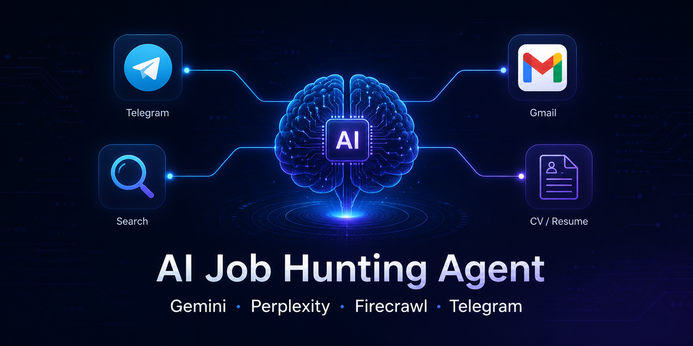

# Step 0 - Prerequisites

Before setting up the AI Job Hunting Agent, ensure you have the following 
accounts, tools, and credentials ready.

---

## Hardware & OS

- MacBook (Apple Silicon recommended)
- macOS 14+ 
- Stable internet connection

---

## Required Software

| Software | Purpose | Install |
|----------|---------|---------|
| OpenClaw | Agent orchestration | [openclaw.io](https://openclaw.io) |
| Terminal | Running commands | Built-in on macOS |
| Git | Version control | `brew install git` |

---

## Required API Keys

| Service | Purpose | Link |
|---------|---------|------|
| Gemini 2.5 Flash | AI brain | [aistudio.google.com](https://aistudio.google.com) |
| Perplexity Pro | Live web search | [perplexity.ai](https://perplexity.ai) |
| Firecrawl | Web scraping | [firecrawl.dev](https://firecrawl.dev) |
| Telegram Bot | Notifications | [@BotFather](https://t.me/BotFather) |

---

## Accounts

- [ ] GitHub account
- [ ] Google account (for Gemini + Gmail)
- [ ] Perplexity Pro 
- [ ] Telegram account + personal channel
- [ ] Firecrawl account

---

## Verify OpenClaw is Running

```bash
openclaw gateway start
```

Expected output: Gateway running on port XXXX

---

## Next Step

[Step 1 - OpenClaw Gateway Setup](./STEP1-OpenClaw-Gateway-Setup.md)
